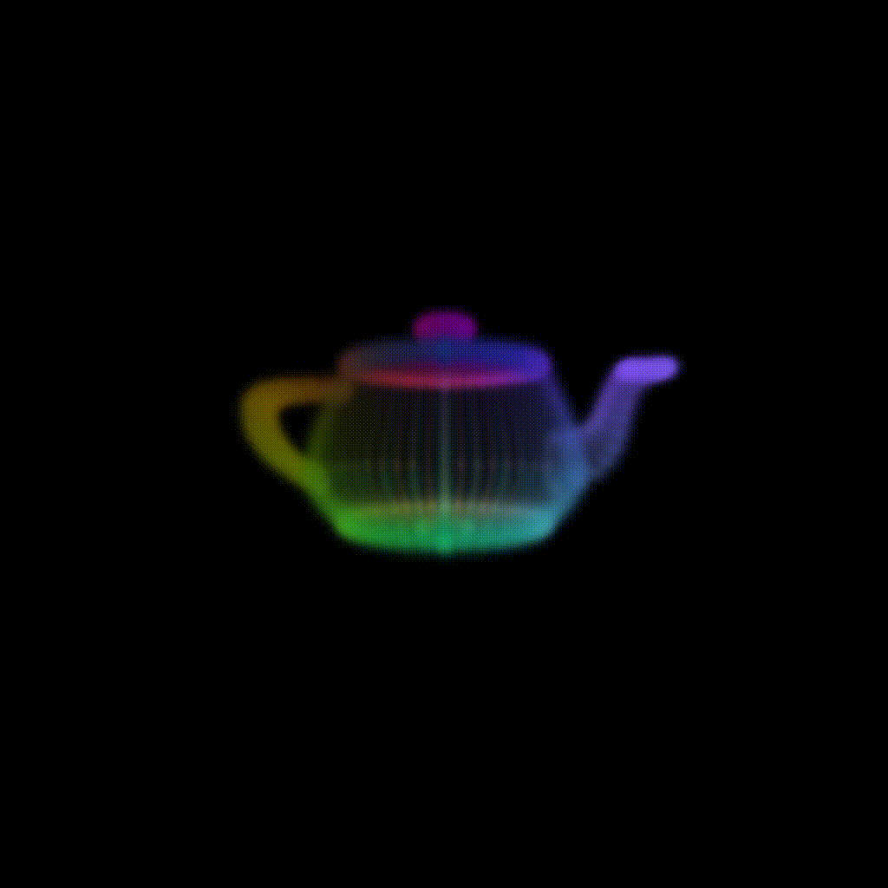
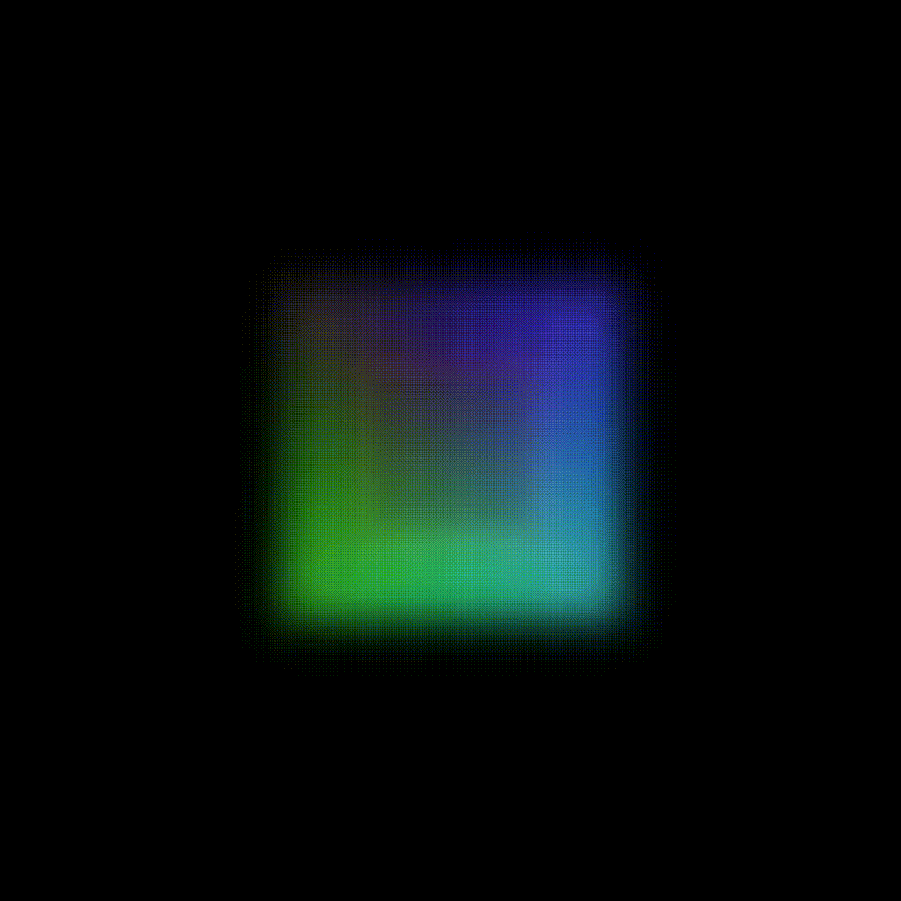

# SIMD Guassian Ray Tracing
<p>


</p>

**Figure 1** - Example Images

The project is split up into three main components:
1. The `vrt` ray tracing library
2. The `vk-renderer` library for displaying images
3. The `volumetric-ray-tracer` example application

All components require `make` and `gcc` version 14 or `clang` version 18. Earlier versions might work, but I have not tested them.

## Compiling
The external dependencies needed for compilation are:
* GLFW (`vk-renderer`, `libglfw3-dev` on Debian)
* FMT (all, `libfmt-dev` on Debian)
* GLM (`vrt`, `vk-renderer`, `libglm-dev` on Debian)
* Vulkan (`vk-renderer`, `libvulkan-dev`, `vulkan-validationlayers` and `spirv-tools` on Debian)
* SVML (`vrt`, optional, distributed through Intel's compiler)

On Debian compilation might fail using `gcc`, therefore using `clang` is recommended.

[Premake](https://premake.github.io/) can be used for compilation, but there is a fallback Makefile in case premake is not available.
A list of all targets available in the Makefile can be accessed using `make help` or just `make`.

```sh
make <target>  # ARGS=[additional args]
               #   --use-gcc    use gcc instead of clang
               #   --with-svml  use SVML routines as defaults
               #   --save-temps save temporary files (e.g. generated assembly)
```

Note that the compiler has to be set using the `CXX` environment variable if the fallback Makefile is used. For premake `clang` is the default.

# Used Libraries
* [T-SIMD](http://www.ti.uni-bielefeld.de/html/people/moeller/tsimd_warpingsimd.html)
* [GLFW](https://github.com/glfw/glfw)
* [GLM](https://github.com/g-truc/glm)
* [ImGui](https://github.com/ocornut/imgui)
* [fmt](https://github.com/fmtlib/fmt)
* [Vulkan-Hpp](https://github.com/KhronosGroup/Vulkan-Hpp)
* [Vk-Bootstrap](https://github.com/charles-lunarg/vk-bootstrap)
* [VMA](https://github.com/GPUOpen-LibrariesAndSDKs/VulkanMemoryAllocator)
* [stb](https://github.com/nothings/stb)
* [jevents (pmu-tools)](https://github.com/andikleen/pmu-tools/tree/master/jevents)
* [vector-class-library](https://github.com/vectorclass/version2)
* [tiny-obj-loader](https://github.com/tinyobjloader/tinyobjloader)
* [SVML](https://www.intel.com/content/www/us/en/docs/cpp-compiler/developer-guide-reference/2021-8/intrinsics-for-short-vector-math-library-ops.html)
