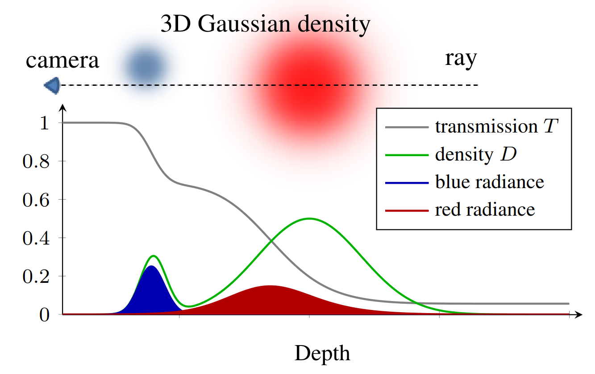

Agenda
===

* Notation
* Algorithm
    * Overview
    * Maths
* Optimization
    * SIMD
    * Tiling
    * Threads
    * What are the challanges?
* Preliminary Results

<!--end_slide-->

Notation
===

We will use the following notation:

<!--end_slide-->

Algorithm
===

# Ray Tracing



<!--end_slide-->

Algorithm
===

# Mathematical Representation

* Integrate Radiance for each pixel in the image via approximation:
```latex +render
\[ \hat{L}(\mathbf{o}, \mathbf{n}) = \sum_q \mathbf{a}_q \sum_{s \in S_q} \lambda_q T(\mathbf{o}, \mathbf{n}, s)G_q(\mathbf{o} + s\mathbf{n}) \]
```
```typst +render
- $hat(L)$: Radiance
- $bold(o)$: origin of the ray
- $bold(n)$: direction of the ray
- $T$: transmittance
- $G_q$: density of the gaussian $q$
- $bold(a)_q$: albedo of gaussian $q$
- $S_q$: set of sample points along the ray to consider for gaussian $q$
- $lambda_q$: step length for gaussian $q$
```
<!--end_slide-->

Optimization
===

# SIMD

Modern CPUs SIMD (Single Instruction Multiple Data) instruction sets allow us to perform a given operation on a vector values at the same time without distributing the tasks to multiple CPUs/threads.

<!--pause-->

## Some More Notation

```latex +render
\begin{itemize}
\item $X^W$ - SIMD vector of width $W$
\item $\odot$ - Element-wise multiplication of SIMD vectors
\item $\langle \cdot \rangle^W$ - Broadcast a scalar to a SIMD vector of width $W$
\end{itemize}
```

<!--end_slide-->

Optimization
===

# SIMD

Now we can rewrite the radiance formular to operate on multiple gaussians at the same time:
```latex +render
\begin{align}
    \hat{L}^W(\mathbf{o}, \mathbf{n}) = \sum_{m = 0}^N \left(\begin{pmatrix}
            \mathbf{a}_{mW}\\\vdots\\\mathbf{a}_{(m + 1)W - 1}
        \end{pmatrix} \odot \begin{pmatrix}
            \sum_{s \in S_{mW}} \lambda_{mW} T(\mathbf{o}, \mathbf{n}, s)G_{mW}(\mathbf{o} + s\mathbf{n})\\
            \vdots\\
           \sum_{s \in S_{(m + 1)W - 1}} \lambda_{(m + 1)W - 1} T(\mathbf{o}, \mathbf{n}, s)G_{(m + 1)W - 1}(\mathbf{o} + s\mathbf{n}) 
        \end{pmatrix}\right)\\
    \hat{L}(\mathbf{o}, \mathbf{n}) = \sum_{i = 0}^W \hat{L}^W_i(\mathbf{o}, \mathbf{n})
\end{align}
```

<!--pause-->

Or we can perform the calculation for multiple pixels at the same time:
```latex +render
\[
    \hat{L}^W(\mathbf{o}^W, \mathbf{n}^W) = \sum_q \left( \langle\mathbf{a}_q\rangle^W \odot \sum_{s \in S_q} \left( \langle \lambda_q\rangle^W \odot T(\mathbf{o}^W, \mathbf{n}^W,\ \langle s\rangle^W) \odot G_q(\mathbf{o}^W + \langle s\rangle^W \odot \mathbf{n}^W) \right) \right)
\]
```
<!--end_slide-->

Optimization
===

# Tiling

- Seperate the image into tiles of some size.
- Determine which gaussians affect which tiles.
- Only consider gaussians that have an effect on a tile when rendering that tile.

<!--pause-->

```typst +render
#import "@preview/cetz:0.2.2"
#set align(center)
#cetz.canvas(length: 5cm, {
    import cetz.draw: *

    circle((0.3, 0.15), radius: 0.01, fill: red, stroke: red)
    circle((0.3, 0.15), radius: 0.2, stroke: red)
    circle((0.4, 0.3), radius: 0.01, fill: green, stroke: green)
    circle((0.4, 0.3), radius: 0.15, stroke: green)
    circle((0.5, 0.2), radius: 0.01, fill: blue, stroke: blue)
    circle((0.5, 0.2), radius: 0.1, stroke: blue)

    circle((1.3, 0.6), radius: 0.01, fill: purple, stroke: purple)
    circle((1.3, 0.6), radius: 0.275, stroke: purple)

    rect((0,0), (rel: (1.6, 0.9)), name: "image")
    grid((0,0), (rel: (1.6, 0.9)), stroke: gray + .5pt, step: (0.4, 0.225))
})
```

<!--end_slide-->

Optimization
===

# Threads

Maybe remove this.

<!--end_slide-->

Optimization
===

# Challanges

<!--end_slide-->

Preliminary Results
===

NOTE: Add some image here: e.g. teapot

<!--end_slide-->

Preliminary Results
===

# Timings
## Non Tiled
* Sequential
* SIMD along pixels:
* SIMD along gaussians
## Tiled
* Sequential:
* SIMD along pixels:
* SIMD along gaussians
* Threads only:
* SIMD along pixels + Threads:
* SIMD along gaussians + Threads:
